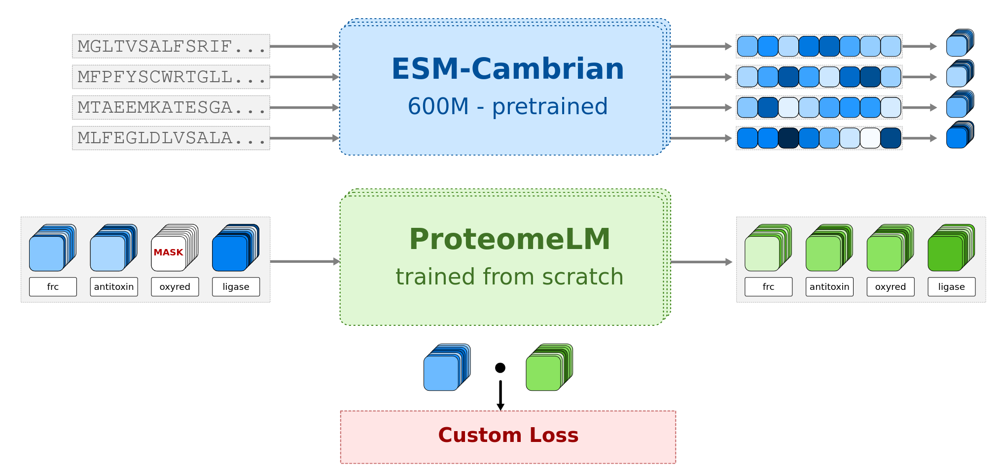

# ProteomeLM: A proteome-scale language model allowing fast prediction of protein-protein interactions and gene essentiality across taxa

<div align="center">

[](https://www.biorxiv.org/content/10.1101/2025.08.01.668221v1.abstract)
[](https://opensource.org/licenses/Apache-2.0)
[](https://www.python.org/downloads/release/python-380/)
[](https://pytorch.org/)
[](https://huggingface.co/collections/Bitbol-Lab/proteomelm-689dc1bbee9afabc10b34931)

[**Paper**](https://www.biorxiv.org/content/10.1101/2025.08.01.668221v1.abstract) | [**Models**](https://huggingface.co/collections/Bitbol-Lab/proteomelm-689dc1bbee9afabc10b34931) | [**Dataset**](https://huggingface.co/datasets/Bitbol-Lab/ProteomeLM-dataset)
</div>



## Overview

**ProteomeLM** is a transformer-based language model that reasons on entire proteomes from species spanning the tree of life. Unlike existing protein language models that operate on individual sequences, ProteomeLM learns contextualized protein representations by leveraging the functional constraints present at the proteome scale.

### Key Contributions

- **Proteome-scale modeling**: First language model to process entire proteomes across eukaryotes and prokaryotes, capturing inter-protein dependencies and functional constraints
- **Ultra-fast PPI screening**: Screens whole interactomes orders of magnitude faster than classic coevolution-based methods, enabling proteome-wide interaction analysis
- **State-of-the-art performance**: Achieves superior results on protein-protein interaction prediction across species and benchmarks through attention-based interaction detection
- **Gene essentiality prediction**: Novel capability to predict essential genes generalizing across diverse taxa
- **Attention-based insights**: Spontaneously captures protein-protein interactions in attention coefficients without explicit training on interaction data
- **Hierarchical learning**: Leverages OrthoDB taxonomic hierarchy for structured representation learning across the tree of life

## 🚀 Quick Start

### Installation

```bash
# Clone the repository
git clone https://github.com/Bitbol-Lab/ProteomeLM.git
cd ProteomeLM

# Create and activate environment
python3 -m venv venv
source venv/bin/activate  # Linux/Mac
# venv\Scripts\activate  # Windows

# Install dependencies
pip install -r requirements.txt
```

## 🤗 Pre-trained Models

All ProteomeLM models are available on Hugging Face Hub. Choose the appropriate model size for your use case:

| Model | Parameters | Size | Hugging Face | Description |
|-------|------------|------|--------------|-------------|
| [ProteomeLM-XS](https://huggingface.co/Bitbol-Lab/ProteomeLM-XS) | 5.66M | 11.3MB | `Bitbol-Lab/ProteomeLM-XS` | Ultra-lightweight for quick inference |
| [ProteomeLM-S](https://huggingface.co/Bitbol-Lab/ProteomeLM-S) | 36.9M | 73.8MB | `Bitbol-Lab/ProteomeLM-S` | Small model balancing speed and accuracy |
| [ProteomeLM-M](https://huggingface.co/Bitbol-Lab/ProteomeLM-M) | 112M | 225MB | `Bitbol-Lab/ProteomeLM-M` | Medium model for most applications (can't fit biggest proteomes) |
| [ProteomeLM-L](https://huggingface.co/Bitbol-Lab/ProteomeLM-L) | 328M | 656MB | `Bitbol-Lab/ProteomeLM-L` | Large model for maximum performance (can fit biggest proteomes) |


### Training Dataset

The training dataset is also available on Hugging Face:
- **[ProteomeLM-dataset](https://huggingface.co/datasets/Bitbol-Lab/ProteomeLM-dataset)**: Preprocessed OrthoDB embeddings and hierarchical data

## Repository Structure

```
ProteomeLM/
├── 📄 __init__.py                 # Package initialization
├── 📄 setup.py                    # Package setup script
├── 📋 requirements.txt            # Python dependencies
├── 📄 LICENSE                     # Apache 2.0 license
├── 📄 README.md                   # Project documentation
├── 📄 paper.pdf                   # Research paper
├── 🐳 Dockerfile                  # Container configuration
├── 📁 configs/                    # Training configuration files
│   └── proteomelm.yaml           # Base configuration
├── 📁 proteomelm/                # Core model implementation
│   ├── __init__.py              # Package initialization
│   ├── cli.py                   # Command-line interface
│   ├── config_manager.py        # Configuration management
│   ├── modeling_proteomelm.py    # ProteomeLM model architecture
│   ├── trainer.py               # Custom training logic
│   ├── train.py                 # Training functions
│   ├── dataloaders.py           # Data loading utilities
│   ├── encode_dataset.py        # Dataset encoding
│   ├── utils.py                 # Utility functions
│   └── ppi/                     # PPI-specific components
│       ├── __init__.py          # Package initialization
│       ├── config.py            # PPI configuration
│       ├── data_processing.py   # Data preprocessing
│       ├── evaluation.py        # Performance evaluation
│       ├── experiment_runner.py  # Experiment management
│       ├── feature_extraction.py # Feature engineering
│       ├── main.py              # Main PPI runner
│       ├── model.py             # PPI models
│       └── utils.py             # PPI utilities
├── 📁 experiments/              # Research experiments
│   ├── __init__.py              # Package initialization
│   ├── fast_orthodb_matching.py # Ortholog matching utilities
│   ├── nb_plots.ipynb           # Analysis notebook
│   └── interactomes/            # Interactome analysis
│       ├── human.ipynb          # Human interactome analysis
│       └── pathogens.ipynb      # Pathogen interactome analysis
├── 📁 notebooks/                # Analysis notebooks
│   ├── ppi_prediction.ipynb     # PPI prediction notebook
│   └── notebooks_utils.py       # Notebook utilities
├── 📁 weights/                  # Pre-trained model weights
│   ├── ProteomeLM-XS/           # Extra small model weights
│   ├── ProteomeLM-S/            # Small model weights
│   ├── ProteomeLM-M/            # Medium model weights
│   └── ProteomeLM-L/            # Large model weights
├── 📁 data/                     # Data storage
│   ├── interactomes/            # Interaction data
│   │   ├── logistic_regression_model_human.pkl
│   │   └── logistic_regression_model_pathogens.pkl
│   └── orthodb12_raw/           # OrthoDB raw data
│       ├── odb12v0_aa.fasta.gz  # Amino acid sequences
│       ├── odb12v0_OG2genes.tab # Gene-ortholog mapping
│       └── odb12v0_OG_pairs.tab # Ortholog pairs
└── 📁 img/                      # Documentation images
    └── main_fig.png             # Main figure
```

## 🔧 Usage


### Quick Start: Fast PPI prediction

For interactive PPI prediction with multiple data sources, use our comprehensive Jupyter notebook:

```bash
# Launch the interactive PPI prediction notebook
jupyter notebook notebooks/ppi_prediction.ipynb
```

**[Open Notebook](notebooks/ppi_prediction.ipynb)**

The notebook provides a flexible framework supporting:

**Data Sources:**
- **Local FASTA files**: Upload your own protein sequences
- **STRING database**: Download sequences by organism ID (e.g., "9606" for human)
- **UniProt database**: Download sequences by taxon ID
- **UniProt IDs**: Fetch specific protein sequences by accession

**Key Features:**
- Automated ProteomeLM feature extraction using attention mechanisms
- Pre-trained logistic regression models for PPI prediction
- STRING annotation comparison and evaluation
- Comprehensive visualization and analysis

### Gene Essentiality Prediction

TODO

### Training ProteomeLM

Train a new model from scratch or fine-tune existing weights:

```bash
# Using the CLI interface
python -m proteomelm.cli train --config configs/proteomelm.yaml

# Multi-GPU distributed training
torchrun --nproc_per_node=4 -m proteomelm.cli train \
    --config configs/proteomelm.yaml \
    --distributed

# Fine-tune from Hugging Face model
python -m proteomelm.cli train --config configs/proteomelm.yaml --pretrained Bitbol-Lab/ProteomeLM-M \

# Advanced training with custom parameters
python -m proteomelm.cli train --config configs/proteomelm.yaml
```

### Docker Deployment

For containerized execution:

```bash
# Build container
docker build -t proteomelm:latest .

# Run training
docker run --gpus all -v $(pwd):/workspace proteomelm:latest \
    python train.py --config configs/proteomelm.yaml
```

## Installation


```bash
git clone https://github.com/Bitbol-Lab/ProteomeLM.git
cd ProteomeLM
pip install -r requirements.txt

# Load local model
model = ProteomeLMForMaskedLM.from_pretrained("weights/ProteomeLM-M")
```


## Loading Models

```python
# From Hugging Face Hub (recommended)
from proteomelm import ProteomeLMForMaskedLM

model_xs = ProteomeLMForMaskedLM.from_pretrained("Bitbol-Lab/ProteomeLM-XS")
model_s = ProteomeLMForMaskedLM.from_pretrained("Bitbol-Lab/ProteomeLM-S") 
model_m = ProteomeLMForMaskedLM.from_pretrained("Bitbol-Lab/ProteomeLM-M")
model_l = ProteomeLMForMaskedLM.from_pretrained("Bitbol-Lab/ProteomeLM-L")

# From local weights (after git clone)
model = ProteomeLMForMaskedLM.from_pretrained("weights/ProteomeLM-M")
```

## Model Architecture

ProteomeLM employs a novel transformer architecture designed for proteome-scale modeling:

### Key Innovations

- **Proteome-level Context**: Unlike single-protein models, processes entire proteomes.
- **Hierarchical Training**: Leverages OrthoDB taxonomy for structured learning across evolutionary relationships.
- **Attention-based PPI**: Naturally captures protein interactions in attention weights without explicit supervision.
- **Scalable Architecture**: Efficient processing of variable-length proteomes.

### Technical Details

- **Input**: ESM-C protein embeddings (1152D) + ESM-C functional encodings (1152D)
- **Architecture**: Transformer with modified attention for proteome-scale sequences
- **Training**: Masked language modeling on proteome context with hierarchical sampling
- **Loss Functions**: Polarization loss for better protein representation learning
- **Optimization**: AdamW with cosine annealing and gradient clipping

## Citation

If you use ProteomeLM in your research, please cite our paper:

```bibtex
@article{malbranke2025proteomelm,
  title={ProteomeLM: A proteome-scale language model allowing fast prediction of protein-protein interactions and gene essentiality across taxa},
  author={Malbranke, Cyril and Zalaffi, Gionata Paolo and Bitbol, Anne-Florence},
  journal={bioRxiv},
  pages={2025.08.01.668221},
  year={2025},
  publisher={Cold Spring Harbor Laboratory},
  doi={10.1101/2025.08.01.668221},
  url={https://www.biorxiv.org/content/10.1101/2025.08.01.668221v1}
}
```

## License

This project is licensed under the Apache 2.0 License - see the [LICENSE](LICENSE) file for details.

## Acknowledgments

- [EvolutionaryScale](https://www.evolutionaryscale.ai/) team for developping ESM-C

## Contact

[Cyril Malbranke](mailto:cyril.malbranke@epfl.ch)

## 🔗 Quick Links

- 📄 [Paper on bioRxiv](https://www.biorxiv.org/content/10.1101/2025.08.01.668221v1.abstract)
- 🤗 [Model Collection](https://huggingface.co/collections/Bitbol-Lab/proteomelm-689dc1bbee9afabc10b34931)
- 📊 [Training Dataset](https://huggingface.co/datasets/Bitbol-Lab/ProteomeLM-dataset)
- 💻 [Source Code](https://github.com/Bitbol-Lab/ProteomeLM)
- 🐛 [Report Issues](https://github.com/Bitbol-Lab/ProteomeLM/issues)

---

<div align="center">

**[⬆ Back to Top](#proteomelm-a-proteome-scale-language-model-for-fast-prediction-of-protein-protein-interactions-and-gene-essentiality-across-taxa)**

</div>