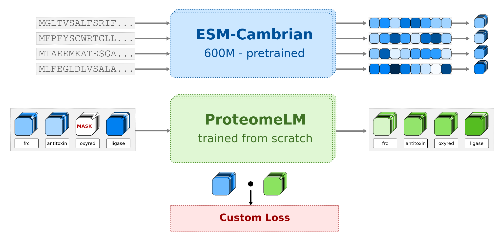

# ProteomeLM: A proteome-scale language model allowing fast prediction of protein-protein interactions and gene essentiality across taxa

<div align="center">

[](https://www.pnas.org/doi/10.1073/pnas.2524201123)
[](https://opensource.org/licenses/Apache-2.0)
[](https://www.python.org/downloads/release/python-3100/)
[](https://pytorch.org/)
[](https://huggingface.co/collections/Bitbol-Lab/proteomelm-689dc1bbee9afabc10b34931)

[**Paper**](https://www.pnas.org/doi/10.1073/pnas.2524201123) | [**Models**](https://huggingface.co/collections/Bitbol-Lab/proteomelm-689dc1bbee9afabc10b34931) | [**Dataset**](https://huggingface.co/datasets/Bitbol-Lab/ProteomeLM-dataset)
</div>



## Overview

**ProteomeLM** is a transformer-based language model that reasons on entire proteomes from species spanning the tree of life. Unlike existing protein language models that operate on individual sequences, ProteomeLM learns contextualized protein representations by leveraging the functional constraints present at the proteome scale.

### Key Contributions

- **Proteome-scale modeling**: First language model to process entire proteomes across eukaryotes and prokaryotes, capturing inter-protein dependencies and functional constraints
- **Ultra-fast PPI screening**: Screens whole interactomes orders of magnitude faster than classic coevolution-based methods, enabling proteome-wide interaction analysis
- **State-of-the-art performance**: Achieves superior results on protein-protein interaction prediction across species and benchmarks through attention-based interaction detection
- **Gene essentiality prediction**: Novel capability to predict essential genes generalizing across diverse taxa
- **Host-pathogen interaction (HPI) fine-tuning**: LoRA-adapted asymmetric masking scheme (host proteins masked lightly, pathogen proteins masked heavily, up to fully) with optional blocking of pathogen-pathogen self-attention, transferring proteome-scale pretraining to cross-species host-pathogen interaction prediction — see `proteomelm/hpi/`
- **Attention-based insights**: Spontaneously captures protein-protein interactions in attention coefficients without explicit training on interaction data
- **Hierarchical learning**: Leverages OrthoDB taxonomic hierarchy for structured representation learning across the tree of life

## 🚀 Quick Start

### Installation

```bash
# Clone the repository
git clone https://github.com/Bitbol-Lab/ProteomeLM.git
cd ProteomeLM

# Create and activate environment
python3 -m venv venv
source venv/bin/activate  # Linux/Mac
# venv\Scripts\activate  # Windows

# Install dependencies
pip install -r requirements.txt
# Or, for development (editable install + tests/lint tools):
pip install -e ".[dev]"
# Optional extras: pip install -e ".[notebooks]" for Jupyter, ".[gpu]" for flash-attn, ".[experiments]" for the analysis scripts in experiments/
```

## 🤗 Pre-trained Models

All ProteomeLM models are available on Hugging Face Hub. Choose the appropriate model size for your use case:

| Model | Parameters | Size | Hugging Face | Description |
|-------|------------|------|--------------|-------------|
| [ProteomeLM-XS](https://huggingface.co/Bitbol-Lab/ProteomeLM-XS) | 5.66M | 11.3MB | `Bitbol-Lab/ProteomeLM-XS` | Ultra-lightweight for quick inference |
| [ProteomeLM-S](https://huggingface.co/Bitbol-Lab/ProteomeLM-S) | 36.9M | 73.8MB | `Bitbol-Lab/ProteomeLM-S` | Small model balancing speed and accuracy |
| [ProteomeLM-M](https://huggingface.co/Bitbol-Lab/ProteomeLM-M) | 112M | 225MB | `Bitbol-Lab/ProteomeLM-M` | Medium model for most applications (can't fit biggest proteomes) |
| [ProteomeLM-L](https://huggingface.co/Bitbol-Lab/ProteomeLM-L) | 328M | 656MB | `Bitbol-Lab/ProteomeLM-L` | Large model for maximum performance (can fit biggest proteomes) |

### Training Dataset

The training dataset is also available on Hugging Face:
- **[ProteomeLM-dataset](https://huggingface.co/datasets/Bitbol-Lab/ProteomeLM-dataset)**: Preprocessed OrthoDB embeddings and hierarchical data

## Repository Structure

```
ProteomeLM/
├── 📄 pyproject.toml              # Package metadata, dependencies, optional extras
├── 📋 requirements.txt            # Core Python dependencies
├── 📄 CITATION.cff                # Machine-readable citation
├── 📄 LICENSE                     # Apache 2.0 license
├── 📄 README.md                   # This file
├── 🐳 Dockerfile                  # Container configuration
├── 📁 configs/                    # Training configuration files
│   ├── pretraining/               # Base ProteomeLM pretraining configs
│   │   ├── proteomelm.yaml
│   │   └── proteomelm_alternate.yaml   # Pairs with proteomelm/alternate/modeling_naive.py
│   └── hpi_finetuning/             # HPI LoRA fine-tuning configs
│       ├── base.yaml
│       └── ablations/              # Masking/blocking ablation grid (overrides composed after base.yaml)
├── 📁 proteomelm/                 # Core model implementation
│   ├── modeling_proteomelm.py     # ProteomeLM model architecture
│   ├── trainer.py                 # Custom training logic (polar loss, callbacks)
│   ├── cli.py                     # Training entry point (`python -m proteomelm.cli train`)
│   ├── train.py                   # Training setup (model, datasets, optimizer, Trainer)
│   ├── dataloaders.py             # Pretraining data loading utilities
│   ├── encode_dataset.py          # ESM-C dataset encoding
│   ├── alternate/                 # Learned-OrthoDB-ID-embedding ablation (modeling_naive.py)
│   ├── hpi/                       # Host-pathogen interaction module
│   │   ├── dataloaders.py         # Pair-shard loading + asymmetric masking
│   │   ├── finetune_hpi.py        # HPI LoRA fine-tuning entry point
│   ├── ppi/                       # PPI-specific components
│   │   ├── model.py, feature_extraction.py, config.py, data_processing.py
│   │   ├── notebook_inference.py  # Notebook scoring helpers
│   │   ├── notebook_plots.py      # Notebook figures
│   │   └── notebook_runtime.py    # Notebook data/runtime helpers
│   └── utils/                     # ESM-C embedding + OrthoDB group-vector utilities
├── 📁 experiments/                # Research experiments (not part of the installed package)
│   ├── ablations/                 # Attention-pattern ablation comparisons
│   ├── differential_interactomes/ # Cross-species PPI analysis
│   ├── essentiality/              # Gene-essentiality classifier (PNAS Fig. 5) — see experiments/essentiality/README.md
│   ├── examples/                  # Validation examples (PARIS, ribosome, TRiC)
│   ├── ppi_benchmarks/            # Bernett / D-SCRIPT PPI benchmarks — see experiments/ppi_benchmarks/README.md
│   ├── ppi_bundled_models/        # Trains the bundled supervised PPI models (data/interactomes/)
│   ├── hpi/                 # HPI paper analysis pipeline — see experiments/hpi/README.md
├── 📁 notebooks/                  # Analysis notebooks
│   ├── ppi_prediction_efficient.ipynb  # Interactive PPI prediction (cache/ is gitignored scratch space)
│   └── essentiality_prediction.ipynb   # Gene-essentiality prediction for a whole proteome
├── 📁 tests/                      # Unit tests (pure-Python logic; see Testing below)
├── 📁 weights/                    # Local pre-trained model weights (gitignored; see Loading Models)
├── 📁 data/                       # Small bundled artifacts (interactome classifiers) + OrthoDB cache
└── 📁 img/                        # Documentation images
```

## Configuration

Configs are grouped by what they're for, not by model size — `configs/pretraining/` holds base ProteomeLM training configs (`proteomelm.yaml` is the default; `proteomelm_alternate.yaml` drives the learned-OrthoDB-embedding ablation in `proteomelm/alternate/modeling_naive.py`). `configs/hpi_finetuning/base.yaml` is the full HPI LoRA fine-tuning config (ProteomeLM-M, the main run). Its `ablations/` subfolder holds overrides for the ProteomeLM-S ablation grid: `ablations/base.yaml` (settings shared by the grid) and one file per condition (`abl1`–`abl8`: 4 masking regimes × pathogen self-attention block on/off; `abl9`: the expanded dataset). `--config` accepts several files, merged in order (later file wins on key collision):

```bash
# Base pretraining
python -m proteomelm.cli train --config configs/pretraining/proteomelm.yaml

# HPI fine-tuning
python -m proteomelm.hpi.finetune_hpi --config configs/hpi_finetuning/base.yaml

# One HPI ablation condition (full base, then the grid overrides, then the condition)
python -m proteomelm.hpi.finetune_hpi --config configs/hpi_finetuning/base.yaml \
    configs/hpi_finetuning/ablations/base.yaml configs/hpi_finetuning/ablations/abl8_seed_total_block.yaml
```

Scripts that read data from a shared cluster mount (`proteomelm/ppi/config.py`, `experiments/ppi_benchmarks/run_benchmarks.py`) default to `data` — set `PROTEOMELM_DATA_ROOT` to point them at a different machine's data layout without editing code.

## 🔧 Usage

### Quick Start: Fast PPI prediction

[](https://colab.research.google.com/github/Bitbol-Lab/ProteomeLM/blob/main/notebooks/ppi_prediction_efficient.ipynb)

The notebook [`notebooks/ppi_prediction_efficient.ipynb`](notebooks/ppi_prediction_efficient.ipynb) predicts protein-protein interactions across a whole proteome in minutes. Open it **on Google Colab** with the badge above (pick a GPU runtime; the first cell installs everything), or **locally** from a clone (after the installation above):

```bash
pip install -e ".[notebooks]"
jupyter notebook notebooks/ppi_prediction_efficient.ipynb
```

Run the cells from top to bottom; the **Settings** cell is the only one to edit (a form on Colab, plus an optional ipywidgets form in Jupyter). The defaults rank the partners of *rpoB* and *ftsZ* among the ~4,100 proteins of *E. coli* K-12.

- **Proteins**: a STRING organism (by taxon id), your own FASTA file (uploaded on Colab), the reviewed UniProt proteins of a taxon, or a list of UniProt accessions.
- **What to score**: the best partners of query proteins (gene names or ids), specific pairs, a random sample of pairs, or all pairs.
- **Scores**: `unsupervised_score` (logistic regression on ProteomeLM attention), optionally `supervised_score` (supervised model on attention + ProteomeLM embeddings) and `string_score` (the pair's STRING score, for comparison).
- **Figures**: the top partners of each query colored by STRING support, enrichment of STRING links among the top predictions and ROC against STRING, a per-attention-head AUROC heatmap, a partner network, and attention vs supervised scores. Figures that need STRING or a supervised model are skipped when those are off.
- **Output**: CSV tables of all scored pairs and of the top predictions, plus each figure as PNG and SVG, written to `notebooks/cache/results/` (`./proteomelm_ppi/results/` outside a clone; downloaded automatically on Colab). Downloads and ESM-C embeddings are cached in the same work directory, so re-runs are fast.

ProteomeLM attends over all protein pairs at once, so memory grows with the square of the proteome size (ProteomeLM-S: ~0.6 GB for 4k proteins, ~13 GB for 20k). The notebook checks this before the slow steps and falls back to the CPU when the GPU is too small.

### Host-Pathogen Interaction (HPI) Fine-tuning

`proteomelm/hpi/` fine-tunes a pretrained ProteomeLM (via LoRA) to predict interactions between host and pathogen proteins — a harder setting than intra-species PPI, since there's no coevolutionary signal between host and pathogen to exploit. Training pairs concatenate a host proteome segment with a pathogen proteome segment and mask them **asymmetrically**: the host segment is lightly masked (or not at all) while the pathogen segment is masked heavily, up to entirely, forcing the model to reconstruct pathogen protein representations from host context. An optional `block_pathogen_self_attention` flag prevents pathogen proteins from attending to each other, restricting them to host-mediated context only.

```bash
python -m proteomelm.hpi.finetune_hpi --config configs/hpi_finetuning/base.yaml
```

See `experiments/hpi/README.md` for the analysis pipeline that turns a fine-tuned checkpoint into the paper's figures.

### Gene Essentiality Prediction

[](https://colab.research.google.com/github/Bitbol-Lab/ProteomeLM/blob/main/notebooks/essentiality_prediction.ipynb)

[`Bitbol-Lab/ProteomeLM-ess`](https://huggingface.co/Bitbol-Lab/ProteomeLM-ess) is the essentiality classifier of the paper (Fig. 5B): a two-layer head on ProteomeLM-L's layer-8 embeddings, trained on OGEE essentiality data. Given a whole proteome, it gives each protein a probability of being essential. The notebook [`notebooks/essentiality_prediction.ipynb`](notebooks/essentiality_prediction.ipynb) runs it on a UniProt or STRING proteome or on your own FASTA (open it in Colab with the badge above); from a clone or a pip install:

```bash
python -m proteomelm.essentiality --fasta proteome.fasta --out scores.tsv --top-fraction 0.1   # or --top-n N / --threshold T
```

The TSV lists every protein with `p_essential`, its `rank` and `predicted_essential`. The probabilities are not calibrated across organisms, so rank-based calls (`--top-n`, `--top-fraction`) are recommended.

`experiments/essentiality/` reproduces the essentiality results of the paper (training per-layer classifiers on frozen ProteomeLM and ESM-C embeddings, evaluation, figures); see [experiments/essentiality/README.md](experiments/essentiality/README.md). Its data (OGEE v3 labels on 89 proteomes, with the cross-validation folds) are on Hugging Face: [`Bitbol-Lab/ProteomeLM-ess-data`](https://huggingface.co/datasets/Bitbol-Lab/ProteomeLM-ess-data).

### Training ProteomeLM

Train a new model from scratch or fine-tune existing weights:

```bash
# Using the CLI interface (also installed as `proteomelm-train`)
python -m proteomelm.cli train --config configs/pretraining/proteomelm.yaml

# Multi-GPU training: set `use_one_gpu: "-1"` in the config, then launch with torchrun
torchrun --nproc_per_node=4 -m proteomelm.cli train --config configs/pretraining/proteomelm.yaml

# Fine-tune from Hugging Face model
python -m proteomelm.cli train --config configs/pretraining/proteomelm.yaml --pretrained Bitbol-Lab/ProteomeLM-M
```

`--config` accepts several files, merged in order (later file wins). If `output_dir/namedir` already contains a checkpoint, the model weights are loaded from the latest one (even without `--resume`, and in place of `--pretrained`); `--resume` also restores the optimizer, scheduler and step counter.

### Docker Deployment

For containerized execution:

```bash
# Build container
docker build -t proteomelm:latest .

# Run training
docker run --gpus all -v $(pwd)/data:/app/data proteomelm:latest \
    python -m proteomelm.cli train --config configs/pretraining/proteomelm.yaml
```

## Loading Models

```python
# From Hugging Face Hub (recommended)
from proteomelm import ProteomeLMForMaskedLM

model_xs = ProteomeLMForMaskedLM.from_pretrained("Bitbol-Lab/ProteomeLM-XS")
model_s = ProteomeLMForMaskedLM.from_pretrained("Bitbol-Lab/ProteomeLM-S") 
model_m = ProteomeLMForMaskedLM.from_pretrained("Bitbol-Lab/ProteomeLM-M")
model_l = ProteomeLMForMaskedLM.from_pretrained("Bitbol-Lab/ProteomeLM-L")

# From local weights (after git clone)
model = ProteomeLMForMaskedLM.from_pretrained("weights/ProteomeLM-M")
```

## Citation

If you use ProteomeLM in your research, please cite our paper:

```bibtex
@article{malbranke2026proteomelm,
  title={ProteomeLM: A proteome-scale language model enables accurate and rapid prediction of protein-protein interactions and gene essentiality across taxa},
  author={Malbranke, Cyril and Zalaffi, Gionata Paolo and Bitbol, Anne-Florence},
  journal={Proceedings of the National Academy of Sciences},
  volume={123},
  number={21},
  pages={e2524201123},
  year={2026},
  publisher={National Academy of Sciences},
  doi={10.1073/pnas.2524201123},
  url={https://www.pnas.org/doi/10.1073/pnas.2524201123}
}
```

## License

This project is licensed under the Apache 2.0 License - see the [LICENSE](LICENSE) file for details.

## Acknowledgments

- [EvolutionaryScale](https://www.evolutionaryscale.ai/) team for developping ESM-C

## Contact

[Cyril Malbranke](mailto:cyril.malbranke@epfl.ch)

## 🔗 Quick Links

- 📄 [Paper on PNAS](https://www.pnas.org/doi/10.1073/pnas.2524201123)
- 🤗 [Model Collection](https://huggingface.co/collections/Bitbol-Lab/proteomelm-689dc1bbee9afabc10b34931)
- 📊 [Training Dataset](https://huggingface.co/datasets/Bitbol-Lab/ProteomeLM-dataset)
- 💻 [Source Code](https://github.com/Bitbol-Lab/ProteomeLM)
- 🐛 [Report Issues](https://github.com/Bitbol-Lab/ProteomeLM/issues)

---

<div align="center">

**[⬆ Back to Top](#proteomelm-a-proteome-scale-language-model-allowing-fast-prediction-of-protein-protein-interactions-and-gene-essentiality-across-taxa)**

</div>
